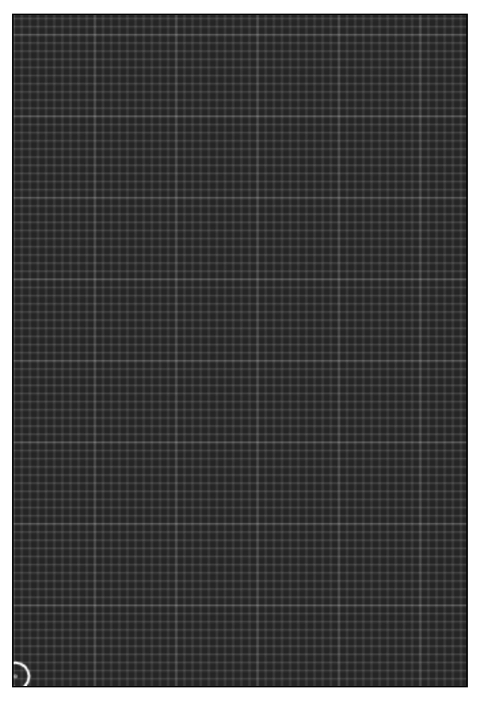

# Physics Simulations

A collection of small physics/maths related programs I created.
You can run the following scripts:

## Project Setup

```bat
npm install
```

## Spin up a Local Development Server
```bat
npm run start
```

## Bundle & Minify for Production

```bat
npm run build
```

## Alter Build Tool & Config

```bat
npm run eject
```


## Routes

## Projectile Motion Simulation

```bat
/projectile-motion-simulation
```
It is a simple program that simulates a projectile motion based on the inserted intial velocity & angle of projection.

Preview: <br /><br />


